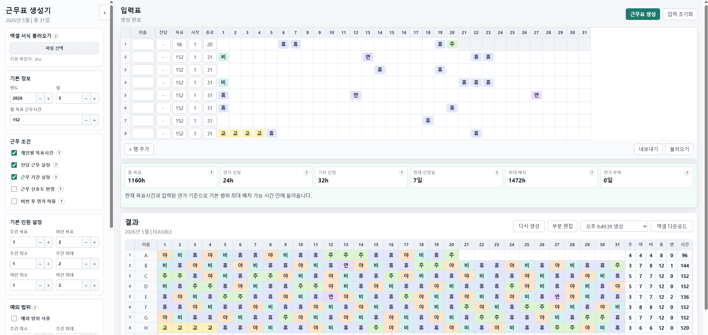

# 지하철 사회복무요원 근무표 생성기

근무 조건을 입력하면 월별 근무표를 자동으로 만들어 주는 프로그램입니다.

4조 2교대를 기준으로 작성되었습니다.

브라우저 화면에서 근무자 이름, 목표 근무시간, 고정 근무, 연가, 기타 근무, 주간/야간 인원 조건 등을 입력할 수 있습니다. 생성된 근무표는 화면에서 확인하고, 필요한 경우 엑셀 파일로 저장할 수 있습니다.

## 다운로드

<a href="https://github.com/magnetic10/Schedule_Generator/releases/latest/download/work-scheduler-v3-windows.zip">
  
</a>

최신 실행파일은 [Releases 페이지](https://github.com/magnetic10/Schedule_Generator/releases/latest)에서 다운받을 수 있습니다.

또는 https://huggingface.co/spaces/magnetic10/schedule-generator 에서 웹 버전으로 사용할 수 있습니다.

## 화면 예시



## 주요 기능

- 월별 근무표 자동 생성
- 주간, 야간, 비번, 휴무, 연가 입력
- 개인별 목표 근무시간 설정
- 근무 시작일/종료일 설정
- 주간 전담/야간 전담 설정
- 근무 선호도 반영
- 기타 근무 추가
- 생성된 근무표 부분 편집 및 부분 재생성
- 입력 상태 내보내기/불러오기
- 엑셀 서식 불러오기
- 엑셀 파일로 결과 저장

## 실행 방법

1. 배포받은 압축 파일을 풉니다.
2. 폴더 안의 `work-scheduler-v3.exe`를 실행합니다.
3. 잠시 기다리면 브라우저가 자동으로 열립니다.
4. 브라우저에서 근무표를 작성합니다.

브라우저가 자동으로 열리지 않으면 실행 창에 표시된 주소를 직접 브라우저 주소창에 입력합니다.

```text
http://127.0.0.1:8007/
```

8007번 주소가 이미 사용 중이면 프로그램이 다른 번호의 주소가 자동으로 사용됩니다.

## 기본 사용 순서

1. 왼쪽 설정에서 연도와 월을 선택합니다.
2. 필요한 경우 기존에 사용하던 엑셀 서식을 불러옵니다.
3. 입력표에 근무자 이름과 근무 조건을 입력합니다.
4. 날짜별로 미리 정해진 근무, 연가, 기타 근무를 입력합니다.
5. `근무표 생성` 버튼을 누릅니다.
6. 결과를 확인합니다.
7. 필요하면 `다시 생성` 또는 `부분 편집`을 사용합니다.
8. 완료된 결과는 `엑셀 다운로드`로 저장합니다.

## 입력 상태 저장과 불러오기

작업 중인 입력표와 설정을 저장하려면 입력표 아래의 `내보내기` 버튼을 사용합니다.

나중에 이어서 작업하려면 `불러오기` 버튼으로 저장해 둔 입력 상태 파일을 불러옵니다.

## 엑셀 서식 사용

기존 근무표 엑셀 서식이 있다면 왼쪽의 `엑셀 서식 불러오기`에서 업로드할 수 있습니다.

서식을 불러오면 프로그램이 이름과 날짜 구조를 인식해 입력표와 결과 저장에 활용합니다.

서식을 불러오지 않아도 기본 서식으로 엑셀 파일을 저장할 수 있습니다.

## 종료 방법

프로그램을 종료하려면 실행 중인 검은색 창을 닫거나 `Ctrl+C`를 누릅니다.

브라우저 탭만 닫으면 화면만 닫히고 프로그램이 계속 실행 중일 수 있습니다.

## 참고 사항

- 이 프로그램은 Windows 환경을 기준으로 배포됩니다.
- 업로드한 엑셀 서식과 생성한 결과 파일은 사용자의 PC 안에서만 처리됩니다.
